<div align="center">



</div>

<div align="center">

### Custom Skills Collection for Claude Code

[](https://claude.ai/code)
[](https://open.bigmodel.cn/)
[](LICENSE)

[日本語](README.md) | **English**

A collection of practical custom skills to enhance Claude Code productivity.

</div>

---

## ✨ Overview

`zero-cc` is a custom skill collection created to improve Claude Code productivity. From GitHub repository creation to maintenance and automatic generation of new skills, it automates the development workflow.

## 📦 Included Skills

<div align="center">

| Skill | Description |
|:------:|------|
| **extension-generator** | Automatically generate Claude Code extensions (skills/agents) from natural language |
| **fal-ai** | Image generation/editing/video creation with fal.ai API (auto-save prompt metadata) |
| **repo-create** | Create and initialize new GitHub repositories (AI-generated header images) |
| **repo-flow** | Git Flow workflow (branch/PR/merge) |
| **repo-maintain** | Maintain existing repositories (release/changelog/status) |
| **remotion** | Best practices for Remotion video creation (React-based) |
| **voicevox** | Japanese speech synthesis using VOICEVOX Engine |

</div>

---

### 🔧 extension-generator

A meta-skill that automatically generates Claude Code extensions from natural language instructions.

**Supported extensions:**
- **Skills** - Prompt reuse, specialized knowledge, workflows
- **Sub-agents** - Specialized AI with independent context
- **Project settings** - CLAUDE.md / .mcp.json

```bash
# Create a skill
/extension-generator Create a code review skill

# Create a sub-agent
/extension-generator Create a frontend optimization agent
```

---

### 📁 repo-create

Create and initialize a new GitHub repository.

**Features:**
- Repository creation with `gh repo create`
- Auto-generate README.md / .gitignore / LICENSE
- AI-generated header images (fal.ai Nano Banana Pro)
- Auto-run initial commit

```bash
/repo-create my-awesome-project
/repo-create my-app --private --description "My awesome app"
```

---

### 🎨 fal-ai

Generate images, edit images, and create videos using fal.ai API.

**Features:**
- **Image generation** - Create high-quality images from text (Nano Banana Pro, Qwen Image 2512)
- **Image editing** - Edit existing images with prompts
- **Video generation** - Create videos from images (LTX-2)
- **Video with audio** - Create videos with audio from images (LTX-2 19B Distilled)
- **Auto-save prompts** - Automatically save prompt metadata as `.md` files alongside outputs

```bash
# Image generation
"Create a marketing banner with text 'SUMMER SALE'"
"Create an image of a sunset mountain range"
"Generate a cat illustration"

# Image editing
"Make the sky blue in this photo"

# Video generation
"Create a video from this photo"
"Create a video with audio from this photo"
```

---

### 🌊 repo-flow

Execute Git Flow workflow from development to merge.

**Features:**
- **Feature branch creation** - Create branch from `develop`
- **PR creation** - Auto-generate PR from changes
- **Code review** - Assist with PR reviews
- **Merge** - Execute merge after review completion

```bash
/repo-flow feature add-user-auth
/repo-flow pr
/repo-flow review
/repo-flow merge
```

---

### 🚀 repo-maintain

Assist with maintenance tasks for existing GitHub repositories.

**Features:**
- **Release creation** - Git tag + GitHub release + release notes
- **Changelog** - Auto-classify from commit logs
- **Issue creation** - Template-based issue creation
- **Status check** - Display repository summary

```bash
/repo-maintain release 1.0.0
/repo-maintain changelog
/repo-maintain issue "Bug: Login fails"
/repo-maintain status
```

---

### 🎬 remotion

Best practices collection for Remotion (React-based video creation framework).

**Features:**
- Comprehensive documentation with 36 rule files
- Animation, transition, caption implementation patterns
- 3D content support (Three.js)
- Chart and data visualization patterns

```bash
/remotion Create a video
/remotion Add captions
```

---

### 🎙️ voicevox

Synthesize Japanese speech using VOICEVOX Engine.

**Features:**
- Generate natural Japanese speech (WAV format) from text
- Select from multiple characters (Shikoku Metan, Zundamon, etc.)
- Adjustable speed, pitch, volume, and intonation

```bash
"Read this text aloud"
"Generate speech"
"Create speech saying 'Hello, world'"
```

---

## 🚀 Setup

### Requirements

- [GitHub CLI](https://cli.github.com/) (`gh`) installed
- Authenticated with `gh auth login`

### Installation

#### Method 1: Using Installer (Recommended)

Claude Code will be automatically installed.

```bash
curl -fsSL https://raw.githubusercontent.com/Sunwood-ai-labs/zero-cc/main/script/install.sh | bash
```

After installation, the following commands will be available:
- `cc-st` - Claude Code (standard mode)
- `cc-glm` - Claude Code (GLM/Z.AI mode)
- `ccd-st` - Claude Code Dangerous (standard mode)
- `ccd-glm` - Claude Code Dangerous (GLM/Z.AI mode)

#### Method 2: Manual Installation

1. Clone this repository
2. Open the project in Claude Code
3. Skills will be automatically loaded

```bash
git clone https://github.com/Sunwood-ai-labs/zero-cc.git
cd zero-cc
```

---

## 📁 Structure

```
zero-cc/
├── .claude/
│   └── skills/
│       ├── extension-generator/
│       │   ├── SKILL.md
│       │   └── references/
│       ├── repo-create/
│       │   ├── SKILL.md
│       │   └── references/
│       ├── repo-flow/
│       │   ├── SKILL.md
│       │   └── references/
│       ├── repo-maintain/
│       │   ├── SKILL.md
│       │   └── references/
│       ├── remotion/
│       │   ├── SKILL.md
│       │   └── rules/
│       ├── fal-ai/
│       │   ├── SKILL.md
│       │   ├── scripts/
│       │   │   ├── t2i-nano-banana-pro.ts
│       │   │   ├── t2i-qwen-image-2512.ts
│       │   │   ├── i2i-qwen-image-edit-2511.ts
│       │   │   ├── i2v-ltx-2.ts
│       │   │   ├── i2v-ltx-2-audio.ts
│       │   │   └── utils/
│       │   │       └── prompt-saver.ts
│       │   └── package.json
│       └── voicevox/
│           ├── SKILL.md
│           └── scripts/
├── assets/
│   ├── header.svg
│   └── release-header-v0.2.0.svg
├── script/
│   └── install.sh
├── README.md
├── README_EN.md
├── RELEASE_NOTES.md
└── LICENSE
```

---

## 🎮 Examples

Projects created using ZERO CC:

### [claude-glm-actions-lab](https://github.com/Sunwood-ai-labs/claude-glm-actions-lab)

An experimental repository integrating Claude Code with GLM API via GitHub Actions.

**ZERO CC skills used:**
- `/repo-create` - Repository initialization
- `/repo-maintain` - Release management
- `/extension-generator` - Custom skill generation

**Features:**
- Execute Claude Code via GitHub Actions
- GLM API (Z.AI) integration
- Issue comment & PR review support
- Bot self-trigger prevention

---

## 🤖 Model Used

This project is developed using **GLM-4.7** (Zhipu AI).

### About GLM-4.7

- **Developer**: [Zhipu AI (智谱AI)](https://open.bigmodel.cn/)
- **Release**: December 22, 2025
- **Features**: Optimization for coding scenarios, multi-file processing, deep mathematical reasoning
- **Tool Compatibility**: Compatible with 20+ AI coding tools including Claude Code
- **License**: Open weight model

---

## 📄 License

[MIT License](LICENSE)

---

<div align="center">

Made with ❤️ for [Claude Code](https://claude.ai/code)

</div>
