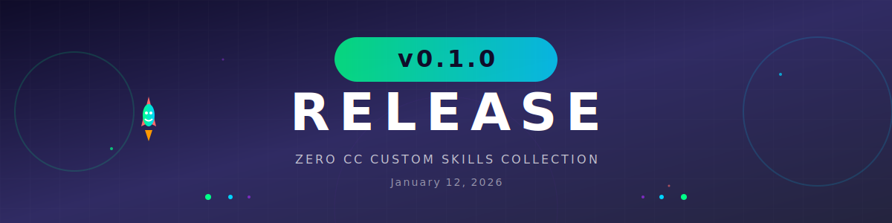

# v0.1.0 - Initial Release

**Release Date:** January 12, 2026

---

## Overview

ZERO CC v0.1.0 is the initial release of the Claude Code custom skills collection. This release includes three powerful skills to enhance your Claude Code workflow.

## What's New

### Skills

- **claude-code-extension-generator**
  - Automatically generate Claude Code extensions from natural language
  - Support for skills, sub-agents, and project configurations
  - Includes reference documentation and templates

- **repo-create**
  - Create and initialize GitHub repositories
  - Automatic README.md, .gitignore, and LICENSE generation
  - Initial commit automation

- **repo-maintain**
  - Release creation with automatic release notes
  - Changelog generation from commit history
  - Pull request and issue creation
  - Repository status summary

### Assets

- Animated SVG header with gradient effects and animations
- Release-specific header image for version announcements

### Documentation

- Comprehensive README with skill descriptions
- GLM-4.7 model information
- Setup and usage instructions

---

## Installation

```bash
git clone https://github.com/Sunwood-ai-labs/zero-cc.git
cd zero-cc
```

Then open the project in Claude Code to automatically load the skills.

---

## Requirements

- [GitHub CLI](https://cli.github.com/) (`gh`) installed
- `gh auth login` completed

---

## Tech Stack

This project was developed using **GLM-4.7** by Zhipu AI.

---

## License

MIT License - see [LICENSE](LICENSE) for details.

---

## Links

- [Repository](https://github.com/Sunwood-ai-labs/zero-cc)
- [Issues](https://github.com/Sunwood-ai-labs/zero-cc/issues)

---

<div align="center">

Made with ❤️ for [Claude Code](https://claude.ai/code)

</div>
